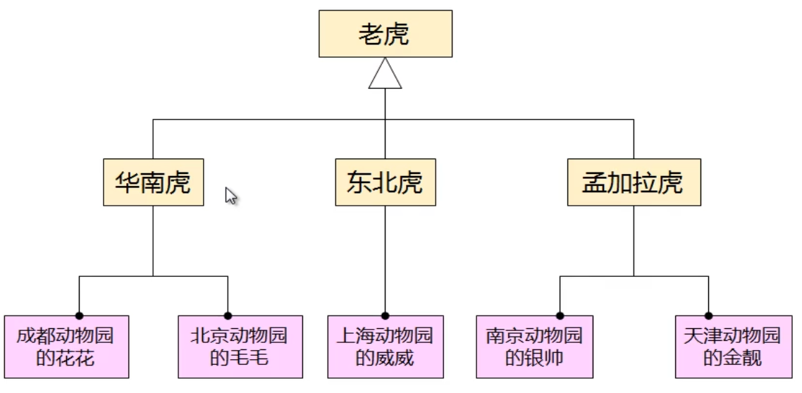
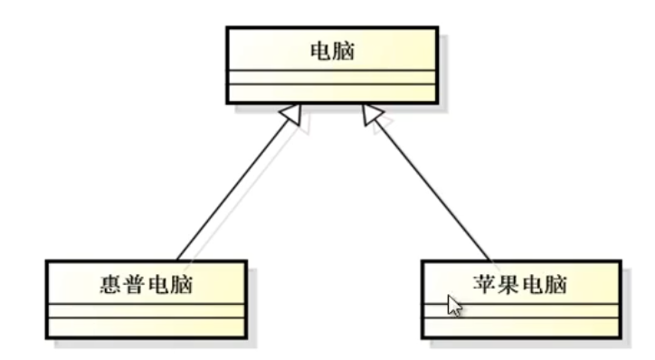
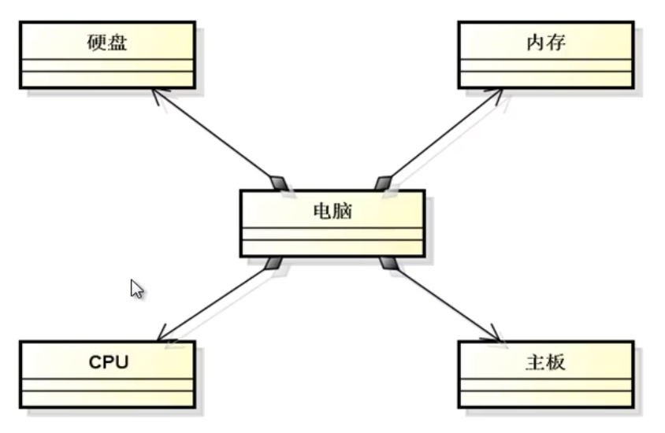

# C++进阶(1) 面向对象

## 1 基本概念

### 1.1 类与对象

- 类：一种模型，通过模型可以创建不同的对象实体。用于描述一类食物所特有的**属性** 和 **行为** 。
- 对象：类模型的一个具体实例。拥有所属类中描述的一切 **属性** 和 **行为** 。

### 1.2 对象创建的问题

- 类 **不一定** 存在实际对象
- 类的对象数目是 **不确定** 的
- 类 **不一定** 来源于现实
- 类不一定是独立的，可能存在关系
- 对象实例不一定只属于一个类
- 对象实例 **不可能** 完全相同

 

## 2 类之间的关系

- 继承
  - 从已存在的类细分出来的类和原类之间具有继承关系（is-a）
  - 继承的类（子类）拥有父类的所有属性和行为

- 组合
  - 一些类依赖于其他类
  - 组合类在某一个局部上由其他类组成

