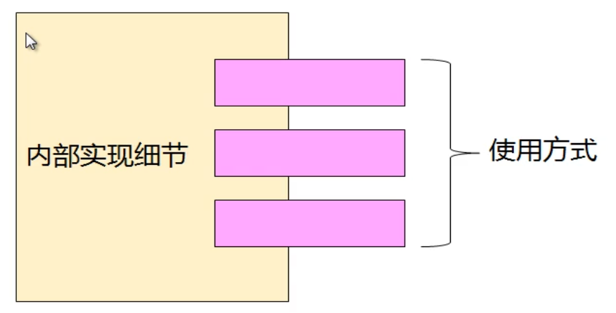

# C++进阶(2) 封装

## 1 类的设计

类分为两部分：

- 类的实现细节
- 类的使用方式

  

##  2 类的封装

对不同类型的事物进行抽象，得到其属性及其行为，使用不同的访问权限将其封装。

- 成员变量：类属性的变量
- 成员函数：类行为的函数

 

访问级别

- public：可以在类内部和外界访问和调用
- private：只能在类内部访问和调用

 

## 3 成员作用域

- 类成员的作用域在类的内部，外部无法访问
- 成员函数可以直接访问成员变量和调用成员函数
- 类的外部可以通过类变量访问 public 成员
- 类成员的作用域与访问级别无关

> C++ 中struct定义的类中所有成员默认为 public。

