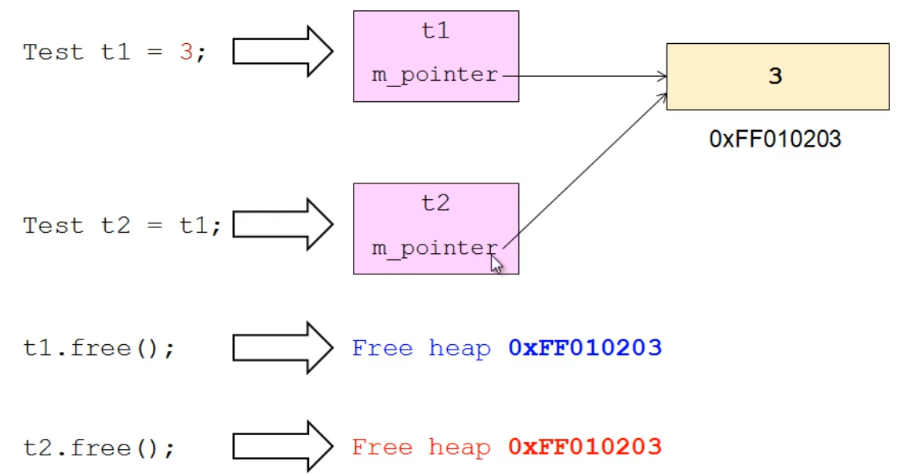

# C++进阶(4) 构造函数

## 4.1 对象的成员初始化值

示例代码：

```C++
#include <stdio.h>

class Test
{
private:
    int i;
    int j;
public:
    int getI() { return i; }
    int getJ() { return j; }
};

Test gt;

int main()
{
    printf("gt.i = %d\n", gt.getI());			// i = 0
    printf("gt.j = %d\n", gt.getJ());			// j = 0
    
    Test t1;
    
    printf("t1.i = %d\n", t1.getI());			// i = 随机值
    printf("t1.j = %d\n", t1.getJ());			// j = 随机值
    
    Test* pt = new Test;
    
    printf("pt->i = %d\n", pt->getI());
    printf("pt->j = %d\n", pt->getJ());
    
    delete pt;
    
    return 0;
}

```

由实验结果，其中全局变量的 i j被初始化为0，而局部变量的i j为随机值，对象由动态内存分配的变量在堆空间中，变量值不定。因为

- 局部变量在 **栈区**，初始值不定
- 全局变量存储在**全局数据区**，初始值统一为0。
- **堆** 空间中的变量，初始值不定

## 4.2 对象初始化

构造函数：与类名相同的函数名。

- 构造函数没有任何返回类型的声明
- 构造函数在定义时被自动调用


## 4.3 构造函数

带有参数的构造函数：

- 类的构造函数可以重载

> 对象定义与声明
>
> - 对象定义：申请对象占用的内存空间，调用构造函数初始化
> - 对象声明： 告诉编译器存在这个对象，链接时会找
>
> ```C++
> Test t;
> 
> int main(){
>   extern Test t;		// 链接时找的变量
>   
>   return 0;
> }
> ```


### 4.3.1 赋值与初始化

在C++中，初始化会调用构造函数，赋值不会调用构造函数  。


### 4.3.2 构造函数的调用

- 构造函数在对象定义时自动调用。
- 手动调用构造函数

```C++
Test ta[3]; 	// 自动调用
Test ta[3] = {Test(), Test(2), Test(2)}；	// 手动调用
```

调用构造函数的方式

```C++
 Test ta = Test(1000); 
```

</br>

## 5 特殊构造函数

## 5.1 无参构造函数（默认构造函数）

- 当类中没有定义构造函数时，编译器默认提供一个无参构造函数，其函数体为空

  

- 拷贝构造函数也是构造函数， 定义拷贝构造函数后，编译器则不会提供任何的构造函数，包括默认构造函数。

## 5.2 拷贝构造函数

拷贝构造函数：参数为 `const class_name&` 的构造函数

- 当类中没有定义拷贝构造函数时，编译器默认提供一个拷贝构造函数，**简单的进行成员变量的值复制** 。

### 5.2.1 拷贝构造函数的意义

- 兼容C语言的初始化方式
- 初始化行为符合预期的逻辑

浅拷贝：拷贝后对象的物理状态相同

深拷贝：拷贝后对象的逻辑状态相同

- 编译器提供的拷贝构造函数是浅拷贝

</br>

浅拷贝 V.S. 深拷贝：如果成员变量有指针类型对象，如果通过默认拷贝构造函数进行浅拷贝，则其拷贝的为指针值，当释放对象时，会释放两次内存，造成内存泄露。



何时需要进行**深拷贝** ？

- 对象的成员指代了系统资源
  - 动态内存空间
  - 打开外存的文件
  - 使用系统的网络端口

</br>

> 自定义拷贝构造函数，必然需要进行深拷贝。

 


