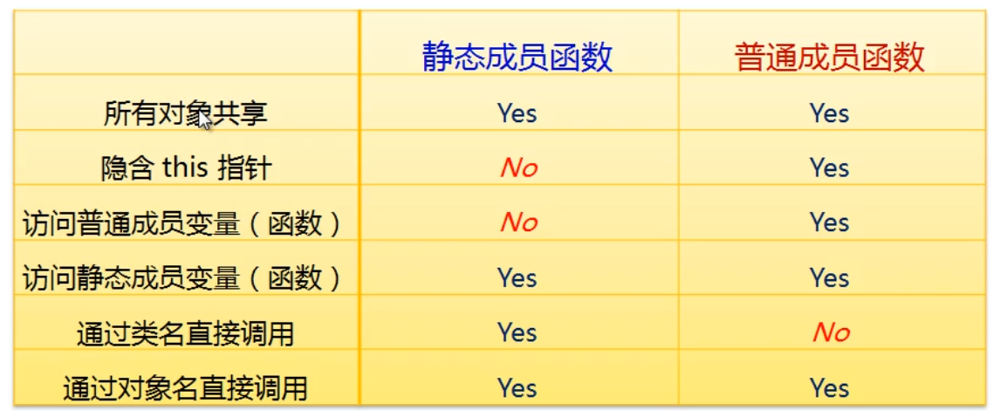

# C++进阶(8) 类的静态成员变量与静态成员函数

统计程序运行期间某个类的对象数目。

类中静态成员变量是所有对象共享的，所以可以通过静态成员变量进行统计对象数目。

## 8.1 静态成员变量的特性

- 静态成员变量属于整个类所有
- 其生命周期不依赖于任何对象
- 可以通过类名访问公有静态成员变量

所以

- 所有对象共享类的静态成员变量
- 可以通过对象名访问公有静态成员变量


语法：

```C++
Type ClassName::VarName = value ;
```

静态成员变量在类外部单独分配空间，其存储在程序内部，位于全局数据区。

</br>

## 8.2 静态成员函数

- 保证静态成员变量的安全性
- 方便的获取静态成员变量

特点：

- 静态成员属于整个类
- 可以通过类名直接访问公有静态成员函数
- 可以通过类对象直接访问静态成员函数

静态成员函数 V.S. 普通成员函数




统计对象个数：

```C++
#include <stdio.h>

class Test
{
private:
    static int cCount;
public:
    Test()
    {
        cCount++;
    }
    ~Test()
    {
        --cCount;
    }
    static int GetCount()
    {
        return cCount;
    }
};

int Test::cCount = 0;

int main()
{
    printf("count = %d\n", Test::GetCount());

    Test t1;
    Test t2;

    printf("count = %d\n", t1.GetCount());
    printf("count = %d\n", t2.GetCount());

    Test* pt = new Test();

    printf("count = %d\n", pt->GetCount());

    delete pt;

    printf("count = %d\n", Test::GetCount());

    return 0;
}

```

## 8.3 小结

静态成员变量和静态成员函数都是**属于类**，可以**通过类名直接访问**，所以在类中设置静态成员变量时，可以通过静态成员函数来进行管理。


