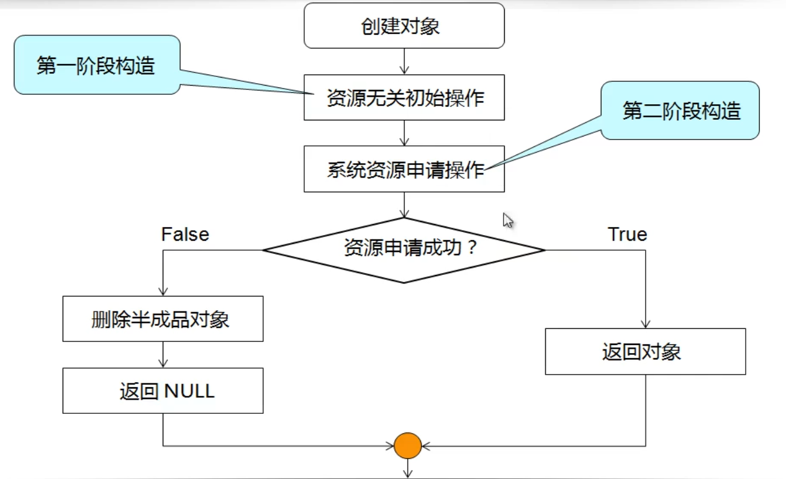
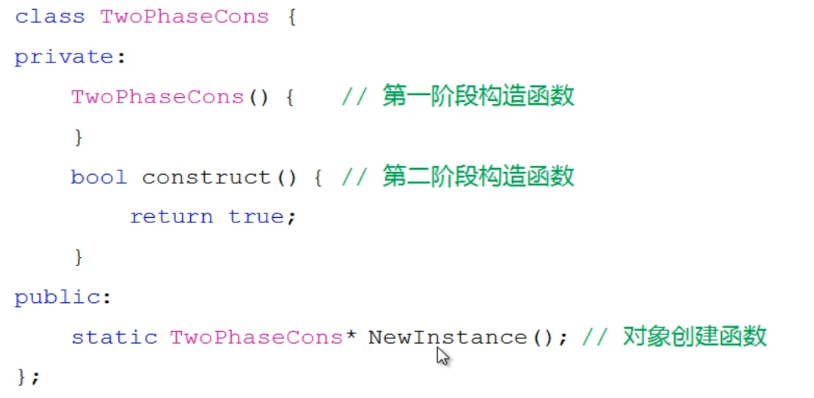

# C++进阶(9) 二阶构造模式

- 如何判断构造函数的返回结果
- 构造函数执行 return 语句会发生什么
- 构造函数执行结束是否意味着对象构造成功

> 实验09-1 : 构造函数return

构造函数中如果含有return，会执行结束，所以构造函数执行结束，并不能说明对象构造成功。

## 9.1 半成品对象

- 初始化操作不能按照预期完成得到的对象
- 半成品对象时合法的C++对象，也是bug的来源

> 实验09-2 : 半成品对象，即构造函数未按照预期完成

在内存分配失败时，程序会发生无法预测的段错误，此时bug无法定位。

## 9.2 二阶构造

构造过程可以分为：

- 资源无关的初始化操作
- 需要系统资源的操作（内存分配，文件管理）

二阶构造函数

> 实验 09-3 ：二阶构造类

