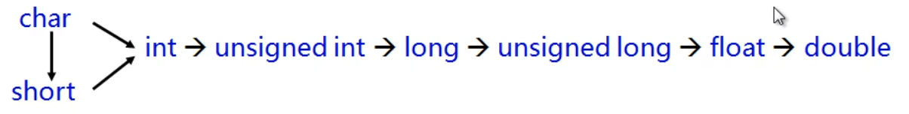

# C++进阶(15) 类型转换

C中的类型之间会进行隐式的类型转换，转换规则如下：



上述类型转换会将小类型转换为大类型。

>  实验15-1 C 语言中的隐式类型转换

</br>

## 15.1 再谈构造函数

构造函数可以定义为不同类型的参数

转换构造函数的参数满足以下条件：

- 有且只有一个参数
- 参数是基本类型
- 参数是其他类型

示例：对于以下语句：

````C++
Test t;
t = 100;
````

当类中有转换构造函数时，将以上代码默认转换为

```C++
Test t;
t = Test(100);
```

其实是将int类型强制转换为 Test 类型。

</br>

对于以上示例，编译器会将类型隐式转换，但工程中，这种隐式转换经常不是我们想要的，所以，为了避免上述情况的发生，通常使用 `explicit` 关键字杜绝编译器的转换尝试。转换方式如下：

```C++
static_cast<ClassName> (value);
ClassName(value);
(ClassName) value; （不推荐）
```

> 15-2 Cpp static_cast 强制类型转换与explicit

</br>

## 15.2 逆转换 / 类型转换函数

能否将类类型转换为 内置类型？

C++类中可以定义类型转换函数，用于将类对象转换为其他类型，语法规则如下

```C++
Operator Type(){
  	Type ret;
  	// ...
  	return ret;
}
```

> 实验5-3 : operator Type() 类型转换函数

</br>

## 15.3 类类型转换

能否将类类型转换为类类型？

转换构造函数可以将一个类类型转换为另一个类类型，如Test类转换为Value类，而类型转换函数也是将一个类类型转换为另一个类类型。所以两个函数是互逆的。如果同时定义，必须将 转换构造函数转换为 explicit 类型。

> 工程中，一般不会使用类型转换函数，避免隐式转换。会使用 `Type toType()` 的共有成员函数代替类转换函数。


