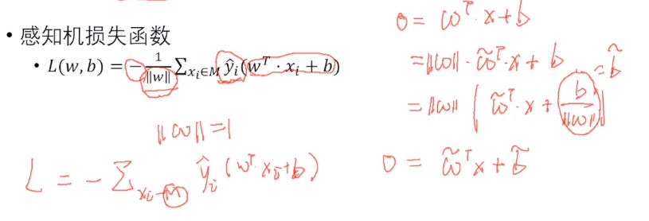

# 深度卷积网络基础

本节课首先介绍了深度卷积网络基础，包括感知机和logistic regression，两种不同的分类损失函数，有其不同的物理意义。其次介绍了特征提取相关基础，包括颜色特征，几何特征等，并进一步介绍了传统的边缘检测方法。最后本节课介绍了良好特征应该具备的三个性质：光照不变性、平移不变形、旋转不变形，并引出卷积神经网络的生物学基础：感受野的概念。

<!--more-->

[TOC]

 ## 感知机

基本思想：通过一个平面，

  

  

  

## Logistic Regression

