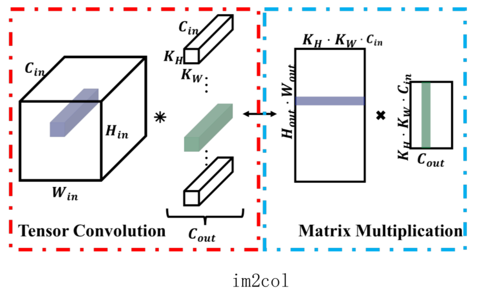

# 深度卷积网络基础

介绍了卷积神经网络的基本单元——卷积层，包括卷积的概念，计算方法，其他新型卷积。卷积层是卷积神经网络最重要的单元之一，是深度学习的重要部分。针对不同的应用场景和任务需求，卷积由最初的形式逐步转化成其他变体形式。卷积的变化使深度学习的应用越来越广，涉及范围越来越大，包括分类、识别、分割等各个领域。

<!--more-->

[TOC]

## CNN基本单元

基本概念：

Kernel ： 一个二维卷积核图像

Filter ：一个立方体

一个卷积核有 $C_{in} * C_{out}$ 个Kernel， $C_{in}$个Kernel 组成一个 Filter， 一个卷积操作中有 $C_{out}$ 个Filter 

### 卷积层

#### 卷积的基本参数

1. 卷积核
2. 滑动步长

stride = 2：加强版的average pooling 

3. padding

使得卷积之后的图像与 `feature map` 大小相同

各种 padding 方式，常见的用 `0` 

4. 输入通道

5. 输出通道

#### 卷积的计算过程

1. 直接计算
2. 将卷积转化为矩阵乘法

#### 卷积好处

权重共享

  

Example:

  

卷积操作动画：https://github.com/vdumoulin/conv_arithmetic

#### 新型卷积

加速：

1. Group conv
2. Depthwise conv

  

  

上采样

1. Deconv： AutoEncoder，分割
2. Dilated conv：增大感受野

'>
	  

  

可变卷积

1. Deformable conv

### 池化层

感受野

### 激活层

非线性

### BN层(Batch Normalization)

保证特征图中的像素点在标准正态分布上

### 全联接层

1. 降维
2. 向量映射

## 经典网络结构

### VGG

### ResNet

### Inception

### GoogleNet

## 深度卷积神经网络应用

### 分类任务

### 识别任务

### 分割任务

