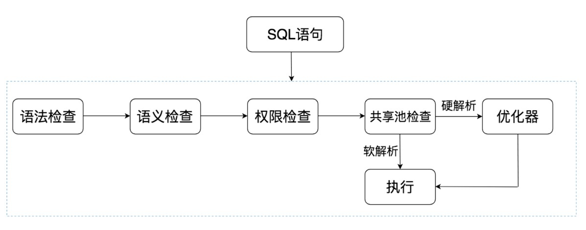
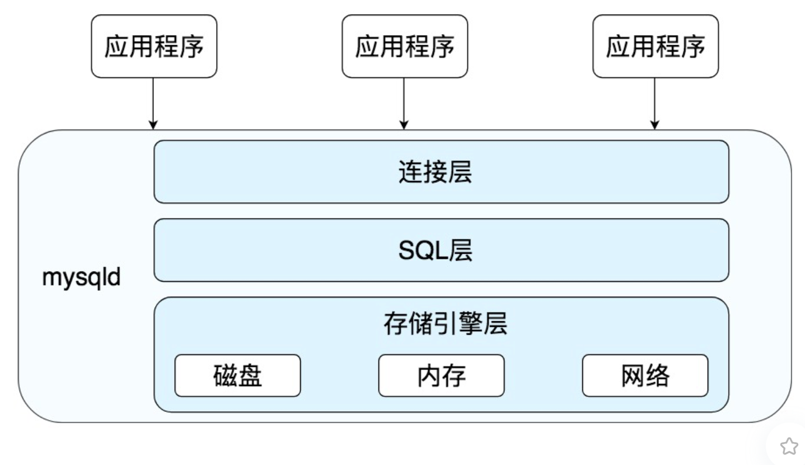
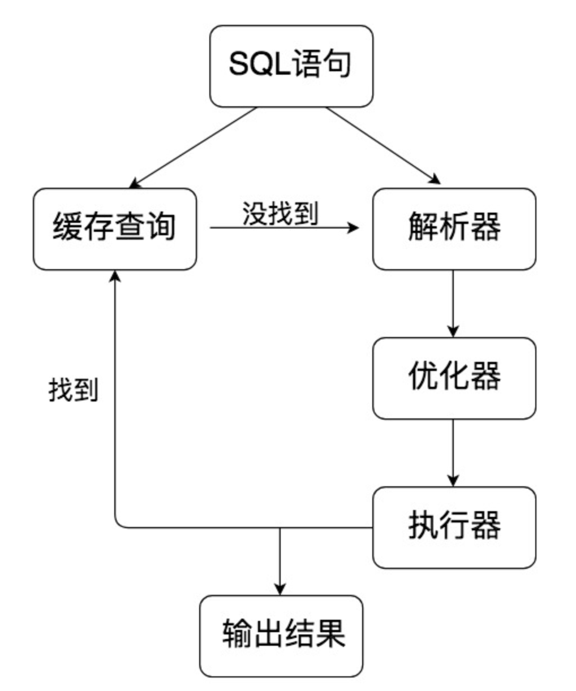

# 搞定SQL系列1 SQL是如何执行的

## 1 SQL执行流程

### 1.1 Oracle 中 SQL执行过程

### 1.2 MySQL中的SQL执行过程

MySQL是典型C/S 架构，服务端程序为mysqld。其中SQL层与数据库文件的存储方式无关，SQL层结构：

SQL语句在MySQL执行流程：SQL语句 -> 缓存查询 -> 解析器 -> 优化器 -> 执行器

 

