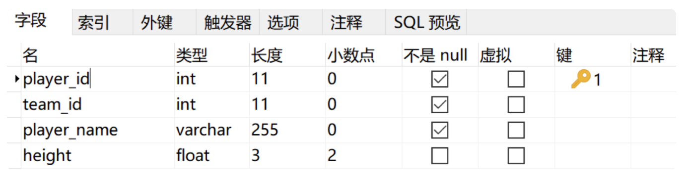

# 搞定SQL系列(2)SQL语句

## 1 数据库定义

```sql
CREATE DATABASE nba;
DROP DATABASE nba;
```

## 2 数据表定义

### 2.1 创建表

```sql
CREATE TABLE [table_name] (字段名 数据类型， ...)
```

示例

- 创建语句建表

```sql
CREATE TABLE player (
	player_id int(11) NOT NULL AUTO_INCREMENT,
  player_name varchar(255) NOT NULL
)
```

- 使用 `navicat` 软件进行建表，并导出建表语句



```sql
DROP TABLE IF EXISTS `player`;
CREATE TABLE `player`  (
  `player_id` int(11) NOT NULL AUTO_INCREMENT,
  `team_id` int(11) NOT NULL,
  `player_name` varchar(255) CHARACTER SET utf8 COLLATE utf8_general_ci NOT NULL,
  `height` float(3, 2) NULL DEFAULT 0.00,
  PRIMARY KEY (`player_id`) USING BTREE,
  UNIQUE INDEX `player_name`(`player_name`) USING BTREE
) ENGINE = InnoDB CHARACTER SET = utf8 COLLATE = utf8_general_ci ROW_FORMAT = Dynamic;
```

其中，`utf8-general_ci` 表示排序规则为大小写不敏感

### 2.2 修改表结构

1. 添加字段

```sql
ALTER TABLE player ADD(age int(11));
```

2. 修改字段名

```sql
ALTER TABLE player RENAME COLUMN age to player_age;
```

3. 修改字段类型

```sql
ALTER TABLE player MODIFY (player_age float(3, 1));
```

4. 删除字段

```sql
ALTER TABLE player DROP COLUMN player_age;
```

### 2.3 常见约束

1. 主键约束
   1. UNIQUE + NOT NULL
   2. 可以是一个字段，也可是多个字段复合
2. 外键约束
   1. 可以重复，可以为空
   2. 外键确保表与表之间的完整性
3. 唯一性约束
   1. 表明任何两个数据不能相同
4. NOT NULL
   1. 字段不应为空，必须有取值
5. DEFAULT
   1. 字段默认值
6. CHECK
   1. 字段取值范围的有效性

### 2.3 设计表的原则

1. 数据表个数越少越好：实体与联系越简洁
2. 数据表中字段越少越好：字段相互独立
3. 数据表中联合主键字段越少越好：减少索引空间
4. 使用主键和外键越多越好：冗余度低，利用度高


