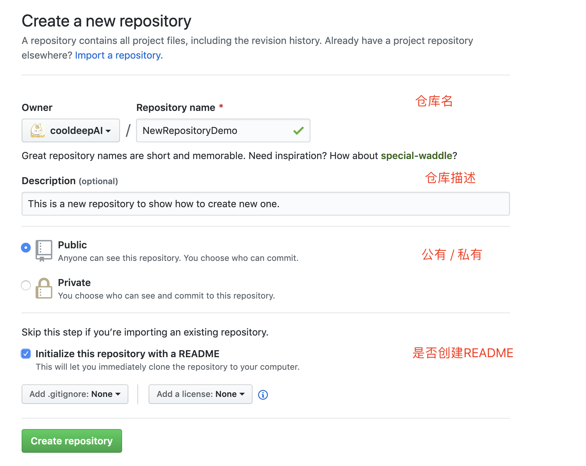
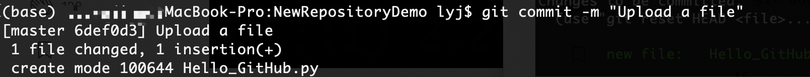
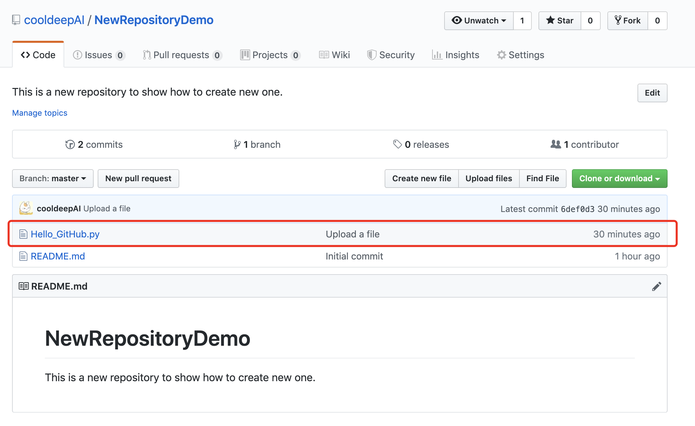

# How to properly use GitHub?

[TOC]


## Terminal

### Prerequisites

1. 注册账号
2. 安装Git

### Step 1: Authenticate Yourself and Your Machine

​        将电脑和Github账户通过`SSH` key 进行认证，在后面每次进行操纵自己仓库时，Github会自动进行认证，无需输入密码。下面创建 `SSH` key：

1. 打开 `terminal`
2. 输入邮箱地址以关联自己的Github账户

```bash
ssh-keygen -t rsa -b 4096 -C "<your email address>"
```

3. 接下来会让你输入保存 `.ssh` 的目录，默认为 `home` 文件夹下，输入 `Enter` 选取默认路径，可在 `~/.ssh/id_rsa`中查看
4. 然后，系统提示选择密码，直接 `Enter` 默认为空。

下面查看一下 `ssh` key 是否创建成功：

```bash
cd ~/.ssh
```

```
ls
```

 `.ssh` 文件夹下有`id_rsa` 和 `id_rsa.pub` 两个文件，其中，`id_rsa` 是私有密钥，`id_rsa.pub` 是公有密钥。

5. 将 `ssh` key 给 ssh-agent 帮助完成验证，下面创建一个ssh-agent

```
eval "$(ssh-agent -s)"
```

查看`~/.ssh` 目录下是否生成 `config` 文件，若有，修改为以下内容，若文件夹中没有 `config` 文件，则自行创建并将以下内容保存至文件中。

```
Host *
 AddKeysToAgent yes
 UseKeychain yes
 IdentityFile ~/.ssh/id_rsa
```

最后，将key添加至代理

```
ssh-add -K ~/.ssh/id_rsa
```

### Step 2: Add the Key to Your Github

下一步将SSH key 添加至Github 账户。将公有密钥复制，在Terminal中输入：

```
pbcopy < ~/.ssh/id_rsa.pub
```

在Github上添加SSH key：


选择 `SSH and GPG keys` ：


新建 `New SSH key`


将复制的公用密钥粘贴至 `Key` 中，`Title` 中可写自己电脑的名称，用以区分不同电脑的 `ssh key` 。


### Step 3: Create a Github Repository

现在已经链接电脑与Github 账户， 可通过电脑管理仓库(Respository)。首先，新建一个仓库：


点击 `New` , 会有新的仓库的描述



创建后，可看到下面的新仓库：


### Step 4: Clone Your Repository

上一步在GitHub上创建了一个新仓库，下面创建一个本地版本的仓库，在 GitHub中称为 `clone` 。首先，点击 `clone and download` , 复制仓库地址：


打开 `Terminal` ， 选择或创建一个保存项目的路径：

```bash
mkdir ~/Desktop/projects
cd ~/Desktop/projects
```

将远程项目 `clone` 至本地， `repository_URL` 是刚才复制的仓库地址：

```
git clone <repository_URL>
```

完成之后，会看到 `projects` 文件夹下已经下载好 `NewRepositoryDemo` 仓库。


### Step 5: Push Your First Commit

上面四步已经将远程仓库和本地电脑链接，可以通过本地对项目进行管理，完成修改后，提交至远程仓库，下面实践提交第一个Github文件。首先，在刚才保存的项目文件夹 `~/home/Desktop/projects/NewRepository` 中，新建一个 `Hello_GitHub.py` 文件，内容为：

```python
print("Hello, GitHub!")	
```

打开 `Terminal` ， 进入仓库目录下，查看仓库状态：

```
cd ~/home/projects/NewRepository/
git status
```


> 本地仓库同步至远程仓库经过以下三个步骤：
>
> 1. 暂存更改（s tasing changes）
> 2. 添加注释（Committing them）
> 3. 推送至远程仓库 （Pushing them to the remote repository）


那么，第一步将暂存本地更改：

```bash
git add Hello_GitHub.py
```

查看仓库状态：

```bash
git staus
```


第二步， 为修改添加注释：

```
git commit -m "commit"
```



`1 file changedj, 1 insertion(+)` ，用于描述修改，这里只添加了1个文件，文件增加了1行。如果修改了多个文件和多个修改，这里都会有修改描述。

第三步，推送至远程仓库。

```bash
git push origin master
or git push
```

现在，查看Github 中的仓库，可以看到添加的文件和注释



### Step 6: Congratulations

成功上传第一个GitHub项目，你可以通过这个过程，不断为项目添加更多文件和更新。通过创建仓库，同步本地和远程仓库，可以更好理解GitHub的工作流程。


## GitHub Desktop

### Prerequisites

1. 注册账号
2. 下载GitHub Desktop


### Step 1: Create/Clone a GitHub Prository

打开 `GitHub Desktop` ， 登陆GitHub账号，新建或者克隆一个仓库。


选择 `Create a new repository` 或者 `clone repository` 


可以看到仓库界面：


### Step 2: Push Repository

在本地创建仓库后，我们需要把仓库推送至GitHub


推送之后，界面会变成下图，


### Step 3: Create a New Branch

GitHub 的版本控制通过 `branch` 进行管理，当我们需要保存当前的版本，并且在当前版本上进行修改时，可通过创建新的分支，把新的更新放在 `branch` 中， 如果需要恢复至更改之前的文件，则只需要修改至原来的 `branch`即可。


### Step 4: Push Branch 

与步骤2相同。


## Reference

1. [在Mac（OS X）中使用GitHub的超详细攻略（20170706）](https://blog.csdn.net/baimafujinji/article/details/74533992)
2. [How to Properly Setup Your Github Repository — Mac Version](https://medium.com/@aklson_DS/how-to-properly-setup-your-github-repository-mac-version-3a8047b899e5)

