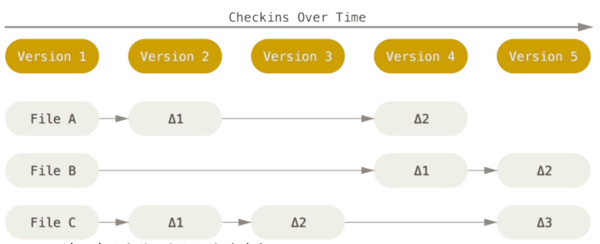
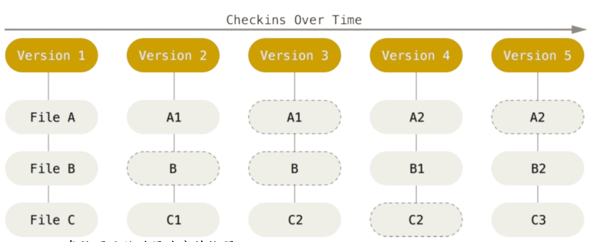

# [Git 札记 3] Git基本概念及其操作

很多时候使用 Git 时，仅仅使用常用的几条命令，比如：`git add .`,  `git commmit -m 'commit'`,  `git push origin master`  ，但并没有真正的理解Git，若能理解Git的思想和基本工作原理，用起来会知其所以然，游刃有余。

<!--more-->

[TOC]

## Git 基础

### Git 的四个特性

1. 直接记录快照，而非差异对比

其他版本控制系统：  

Git ：

相比其他版本控制系统进保存修改内容，Git 每次对全部文件制作快照并保存索引。

2. 