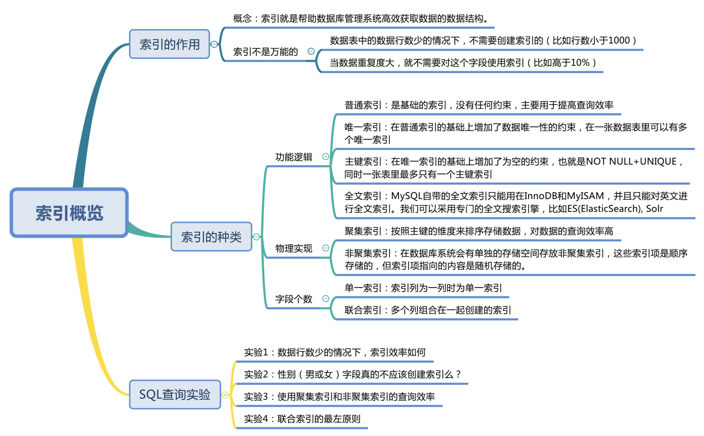

# SQL必知必会(13) 索引

## 13.1 索引的种类

从功能逻辑上分：

- 普通索引：无约束，用于提高查询效率
- 唯一索引：普通索引的基础上增加数据唯一性的约束，表中可以有多个唯一索引。
- 主键索引：在唯一索引的基础上，增加不为空的约束，即NOT NULL+UNIQUE
- 全文索引：MySQL自带的索引只支持英文

从物理实现方式分：

- 聚集索引：按照主键对数据排序存储，索引指向的内容聚集在索引后面
- 非聚集索引（二级索引 / 辅助索引）：只为护索引，不为护索引指向的数据

区别：

1. 聚集索引叶子结点存储数据记录，非聚集索引叶子结点存储数据位置。非聚集索引不会影响数据表的物理存储顺序。
2. 一个表只有一个聚集索引，可以有多个非聚集索引，多个索引目录提供数据检索
3. 聚集索引数据查询效率高，但对数据插入，删除，更新操作，效率比非聚集索引低。

小结

 

## 13.2 B+树索引

### 13.2.1 B树

二叉树的搜索效率为O(logn), 但在某些情况，二叉树会退化为链表。所以提出平衡二叉搜索树，即树中节点的左右子树的高度相差要小于等于1。但对于数据量巨大情况，二叉树的深度logn也会很大，也就是会有logn次的磁盘I/O操作，这种时间消耗是巨大的。

所以，使用二叉树作为索引结构使得树变得很高，增加了硬盘I/O次数，影响查询时间。B树可以有效解决这个问题，B树又叫平衡的多路搜索树，它的高度远小于平衡二叉树的高度。在文件系统和数据库系统中的索引结构常用B树实现。

## 13.3 Hash 索引

### 13.3.1 Hash检索效率

Hash本身是一个散列函数，可以大幅提升检索效率。算法复杂度为O(1)

### 13.3.2 Hash索引的优点和不足

优点：使用Hash检索效率非常高，通常一次检索即可找到数据，而B+树则需要自顶向下查找，多次访问节点才能找到数据，需要进行多次I/O操作，效率上来说，Hash比B+树更快。

不足：Hash冲突。如果桶的空间小于输入的空间，不同的输入可能会映射到同一个桶中，这时会产生Hash冲突，如果Hash冲突量很大，则会影响读取的性能。

### 13.3.3 Hash索引和B+树索引区别及使用场景

1. Hash索引不能进行范围查询，而B+树可以。

2. Hash索引不支持联合索引的最左侧原则，即联合索引的部分索引无法使用，而B+树可以。
3. Hash索引不支持ORDER BY排序，Hash索引指向的数据是无序的，因此无法排序优化，而B+树索引数据是有序的。

等值查询，Hash索引效率更高，不过对于索引列重复值过多，效率会降低。

