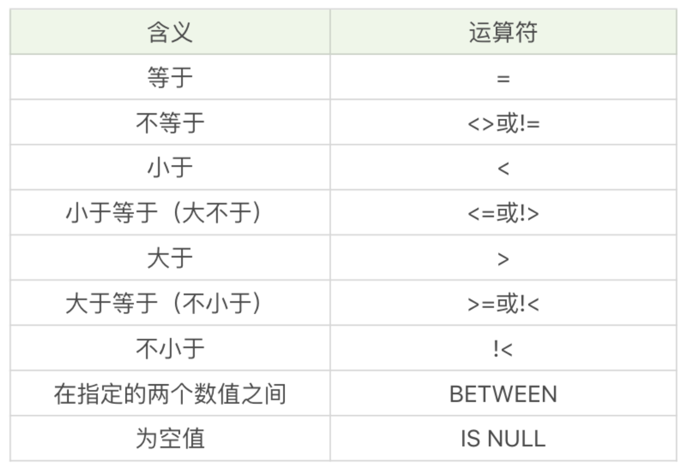
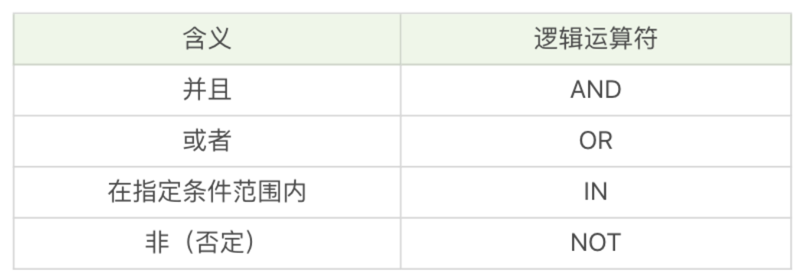

# 搞定SQL系列(3) 数据过滤

&emsp;&emsp;

## 3.1 比较运算符

表3-1 比较运算符及其含义



Where 子句的基本格式

```sql
SELECT ...(列名) FROM ...(表名) WHERE ...(子句条件)
```

示例1：查询所有最大生命值大于6000的英雄

```sql
SELECT name, hp_max FROM heros where max_hp > 6000;
```

示例2：查询所有最大生命值在5399到6811之间的英雄

```sql
SELECT name, hp_max FROM heros WHERE hp_max BETWEEN 5399 AND 6811;
```

示例3：对heros表中的hp_max 字段进行空值查询

```sql
SELECT name, hp_max FROM heros WHERE hp_max IS NULL;
```

</br>

## 3.2 逻辑运算符

表3-2 逻辑运算符及其含义



示例1：筛选最大生命值大于6000，最大法力大于1700，按照最大生命值和最大法力值之和从高到低进行排序。

```sql
SELECT name, hp_max, mp_max FROM heros WHERE hp_max > 6000 AND mp_max > 1700 ORDER BY (hp_max+mp_max) DESC;
```

示例2：查询最大生命值加最大法力值大于8000的英雄，或者最大生命值大于6000并且最大法力值大于1700的英雄。

```sql
SELECT name, hp_max, mp_max FROM heros 
WHERE (hp_max+mp_max)>8000 OR hp_max>6000 AND mp_max > 1700 ORDER BY (hp_max+mp_max) DESC;
```

**AND 优先级比 OR优先级更高** ，所以SQL会优先处理AND运算符，再处理OR运算符。

示例3：查询主要定位和次要定位是法师或射手的英雄，上线时间不在2016-01-01和2017-01-01之间。

```sql
SELECT name, role_main, role_assist, hp_max, mp_max, birthdate
FROM heros
WHERE (role_main IN ('法师', '射手')  OR role_assist IN ('法师', '射手') AND DATE(birthday) NOT BETWEEN '2016-01-01' AND '2017-01-01')
ORDER BY (hp_max + mp_max) DESC
```

</br>

## 3.3 通配符

通配符用于匹配值的一部分的特殊字符，使用`LIKE` 操作符。

- 匹配任意字符出现的任意次数，使用 `%` 通配符。
- ` - ` ：代表一个字符

示例1：查询英雄名中包含“太”字的英雄

```sql
SELECT name FROM heros WHERE name LIKE'%太%';
```

示例2：查询英雄名除了第一个字以外，包含‘太’字的英雄

```sql
SELECT name FROM heros WHERE name LIKE '_%太%';
```

</br>

## 小结

SQL语句保持高效率，要避免全局扫描，考虑在ORDER BY 和 WHERE 涉及的列上增加索引。


