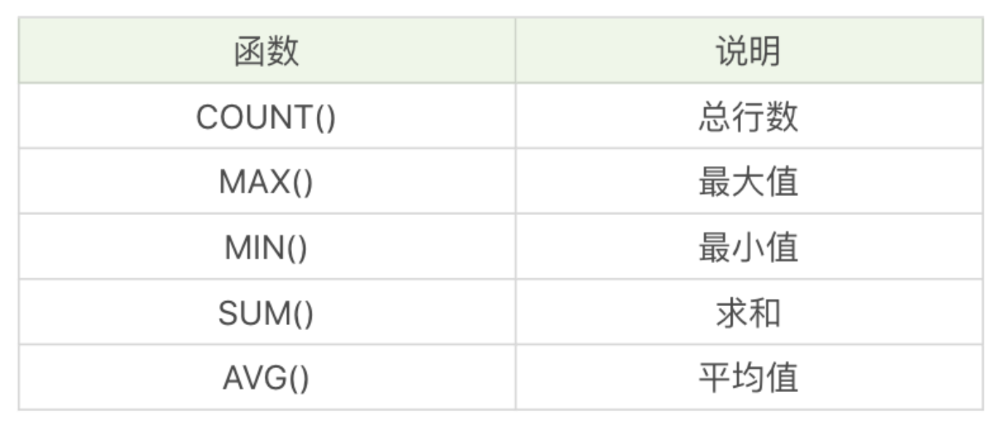

# 搞定SQL系列(4) 聚集函数

## 4.1 聚集函数

SQL中聚集函数由5个：



</br>

示例1 - COUNT() ：查询最大生命值大于6000的英雄数量

```sql
SELECT COUNT(*) FROM heros WHERE hp_max > 6000;
```

示例2 - MAX()：查询射手（主要定位或者次要定位是射手）的最大生命值的最大值是多少？

```sql
SELECT MAX(hp_max) FROM heros WHERE role_main = '射手' OR role_assist = '射手';
```

示例3 - 聚集函数：查询射手（主要定位或者次要定位是射手）的英雄数、平均最大生命值、法力最大值的最大值、攻击最大值的最小值、以及这些英雄总的防御最大值等的汇总数据

```sql
SELECT COUNT(*), AVG(hp_max), MAX(mp_max), MIN(attack_max), SUM(defense_max) FROM heros WHERE role_main = '射手' OR role_assist = '射手';
```

注：AVG、MAX、MIN等聚集函数会自动忽略值为NULL的数据行。


示例4 - 汉字排序：汉子按照全拼拼音进行排列

```sql
SELECT MIN(CONVERT(name USING gbk)), MAX(CONVERT(name USING gbk)) FROM heros;
```

</br>

示例5 - 分组聚集统计：统计不同生命最大值英雄的平均生命最大值，保留小数点后两位。

```sql
SELECT ROUND((AVG(DISTINCT hp_max), 2) FROM heros;
```

</br>

## 4.2 数据分组，聚集统计

对数据分组，使用 group by 子句。

示例6 - GROUP BY分组：按英雄的主要定位分组，统计每组的英雄数量。

```sql
SELECT COUNT(*), role_main FROM heros GROUP BY role_main;
```

示例7 - 多个字段分组：按照英雄的主要定位、次要定位分组，查看英雄的数量，按照从高到低进行排序

```sql
SELECT COUNT(*) AS num, role_main, role_assist FROM heros GROUP BY role_main, role_assist ORDER BY num DESC;
```

</br>

## 4.3 Having与Where

Having 与 Where 都用于过滤数据，但WHERE 用于数据行，HAVING用于分组。

示例8 - HAVING ：按照英雄的主要定位、次要定位分组，筛选英雄的数量大于5的组，按照从高到低进行排序

```sql
SELECT COUNT(*) AS num, role_main, role_assist FROM heros GROUP BY role_main, role_assist HAVING num > 5 ORDER BY num DESC;
```

示例9 - HAVING 与 WHERE 区别：筛选最大生命值大于6000的英雄，按照主要定位、次要定位进行分组，显示分组中英雄数量大于5的分组，数量从高到低进行排序。

```sql
SELECT COUNT(*) as num, role_main, role_assist FROM heros WHERE hp_max > 6000 GROUP BY role_main, role_assist HAVING num > 5 ORDER BY num DESC;
```

</br>

## 小结

1. SQL 语句

WHERE - 数据行过滤

GROUP BY - 数据分组

HAVING - 分组过滤

ORDER BY - 按照字段排序输出

```sql
SELECT ... FROM .. WHERE... GROUP BY ... HAVING ... ORDER BY... 
```

2. 聚集函数及分组


