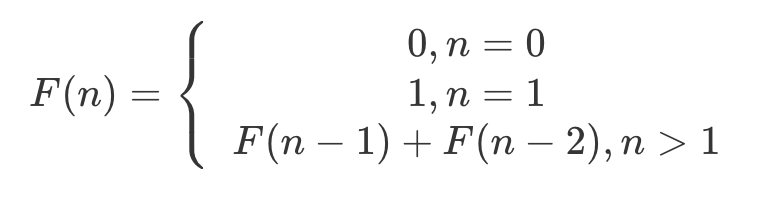

# 搞定动态规划系列(2) 暴力递归

## 2.1 递归实现三要素

1. 确定递归参数和返回值
2. 确定终止条件
3. 确定单层递归的逻辑

</br>

## 2.2 斐波那契数列

斐波那契数列如下所示：



求F(N) 。

迭代版本

```C++
int Fibonacci(int n){
  	if (n == 0 || n == 1)		return n;
  	
  	int i = 1;
  	int fib1 = 0, fib2 = 1, fib = 0;
  	while (i < n){
      	fib = fib1 + fib2;
      	fib1 = fib2;
      	fib2 = fib;
      	++i;
    }
    return fib;
}
```

递归版本：

1. 确定参数和返回值

   ```C++
   int fibonacci(int n);
   ```

2. 确定终止条件

   ```C++
   if (n == 0)		return 0;
   if (n == 1)		return 1;
   ```

3. 确定单层递归逻辑

   ```C++
   return fibonacci(n-1) + fibonacci(n-2);
   ```

```C++
int Fibonacci(int n){
  	if (n == 0 || n == 1)
      	return n;
  	if (n > 1){
      	return Fibonacci(n-1) + Fibonacci(n-2);
    }
  	
  	return -1;		// 输入有误，返回-1
}
```

</br>

## 2.3 优化暴力递归：剪枝与优化

1. 使用贪心，从面值最大的硬币的最大情况
2. 对于递归树中，一些重叠子问题进行剪枝。


