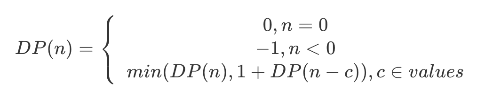

# 搞定动态规划系列(4) 动态规划

## 4.1 动态规划的问题描述

动态规划问题的三个特征：

1. 重叠子问题：在穷举过程中（如递归），存在重复计算的现象
2. 无后效性：子问题之间的依赖是单向的，状态一旦确定，不受后续决策影响
3. 最优子结构：子问题之间相互独立，或者后续计算可以通过哦前面状态推导

</br>

## 4.2 动态规划求解

动态规划核心是写出正确的状态转移方程，确定以下几点：

1. 初始化状态：从最基本的子问题开始。
2. 状态（核心）：找出子问题与原问题之间发生变化的变量，该变量是状态转移方程的参数
3. 决策：改变状态，使得状态不断逼近初始化状态。

硬币找零的动态规划解



```C++
int coinChange(std::vector<int>& coins, int amount){
        //  初值设为amount+1，dp[i] 最多需要i个，i<amount,
        //  所以amount 对于dp[i] 为无穷大，便于后面取最小值
        std::vector<int> dp(amount+1, amount+1);
        dp[0] = 0;

        // 依次求得amount的最小硬币数，即 dp[i]
        for (int i=0; i<dp.size(); i++){
            for (int coin : coins){
                if (i-coin < 0) continue;
                dp[i] = std::min(dp[i], 1+dp[i-coin]);
            }
        }

        return (dp[amount] == amount+1) ? -1 : dp[amount];
    }
```

- 初始状态：dp[0] = 0
- 状态：当前面额所需的最小硬币数
- 决策：选择当前硬币，是否满足最小硬币数

</br>

## 4.3 从贪心到动态规划

贪心算法：根据当前阶段得到局部最优解

递归：自顶向下求的满足条件的所有组合，暴力计算的结果必定是整体最优解 

剪枝优化：对于重叠子问题进行优化，利用备忘录记录子问题的结果。

动态规划：自底向上的计算方式，用迭代代替递归，得到全局最优解。