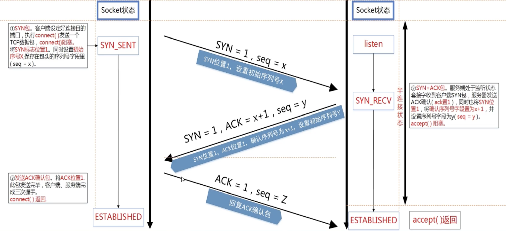

# 如果我是面试官系列(2) 网络篇

1. 客户端挂了以后，服务器怎么办，tcp连接会不会断开（问吐了）

网络编程入门(2) 远方的你还在嘛？

</br>

2. Socket 最多能打开多少个？socket 端口范围是多少？

socket 本质也是文件，所以可以通过查看系统的文件最大打开个数，一般为1024个。

1023以下端口为系统端口

</br>

3. 网络字节序和本地字节序说一下。

大端序：高位字节存放在低位地址，低位字节存放在低位地址。

小端序：高位字节存放在高位地址，低位字节存放在低位地址。

网络字节序一般为大端序，即高位字节在低位地址。网络字节序与主机字节序相互转换的四个函数：

```C++
htons();    ntohs();  htonl();   ntohl();
```

</br>

4. socket编程中的listen()  accept()  connect() 的作用？

Listen() 接受客户端的连接请求，成功返回0，失败返回-1。accept() 是从已经准备好的连接队列中获取一个请求，如果队列为空，accept将阻塞等待，成功返回值为分配给客户端的socket，失败返回-1设置errno。

​						1) 服务端调用 listen() 之前，客户端不能向服务端发起连接请求

​						2) 服务端调用 listen() 后，服务端的socket 开始监听客户端的连接

​						3) 客户端调用 connect() 函数向服务端发起请求连接

​						4) TCP底层客户端与服务端三次握手建立通信通道，如果有多个客户端请求，则服务端会形成一个已准						备好的连接队列

​						5) 服务端调用 accept() 函数从队列中获取一个已准备好的连接，函数返回一个socket ，新的socket 用于						与客户端通信，listen 的socket 只负责监听客户端的连接请求。 

</br>

5. TCP 三次握手说一下




</br> 

6. listen 的soocket 队列？

内核会为listen 状态的socket维护两个队列：不完全请求队列（SYN_RECV状态）和等待accept建立socket 的队列（ESTABLISHED状态）。

blacklog参数指等待accept 的完全建立socket的队列长度，而不是不完全连接请求数量。 不完全连接请求数量可以在 `/proc/sys/net/ipv4/tcp_max_syn_blacklog` 设置（默认为128）。

7. TCP分包与粘包？

分包：指发送方发送字符串"hello world" ，接受方会接受到 "hello" 和 "world"

粘包：指发送方发送字符串 "hello" 和 "world" , 接收方会接受到 "hello world"。

解决方案：因为TCP传输保证两点，第一顺序不变，比如发送方发送hello，接收方一定按照顺序接受到hello。

第二分割包中间不会插入其他数据。所以在实际开发中，为解决分包和粘包的问题，需要自定义一份协议，常见的是报文长度+报文内容 0010+helloworld

