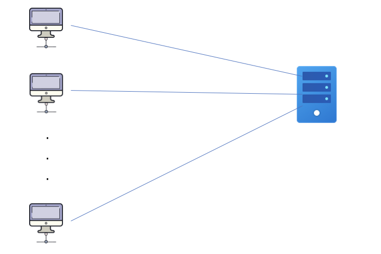
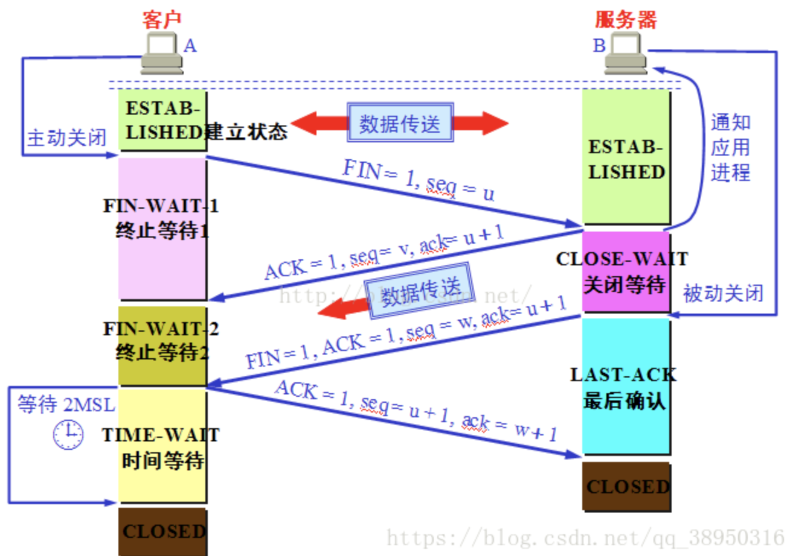
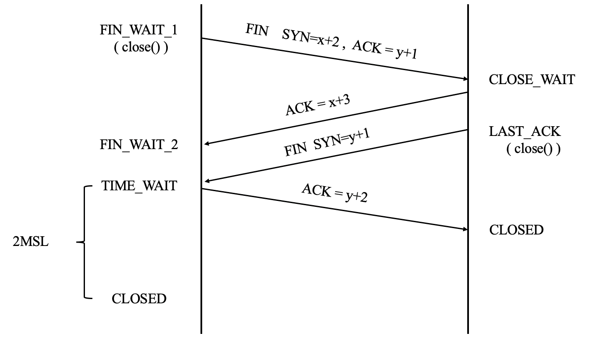

# 网络编程入门(1) TIME_WAIT

## 1.1 TIME_WAIT 的产生

应用服务需要通过发起TCP连接对外提供服务，每个连接会占用一个端口，当在高并发的情况下，TIME_WAIT 状态连接过多，导致本机的可用端口耗尽，应用服务则不能正常工作。

一段时间后，处于TIME_WAIT 状态的连接被系统回收，释放出本地端口，应用服务可正常工作。所以会出现应用服务时而正常，时而中断服务的状况。

 

## 1.2 TIME_WAIT产生的原因

### 四次挥手

FIN_WAIT_1：主机1 （服务端 客户端都可发起）设置SYN、ACK，向主机发送一个FIN报文段，该阶段主机1没有数据要发送至主机2

FIN_WAIT_2：主机2 收到主机1的FIN报文，发送ACK确认，表示同意主机1关闭连接，主机2进入CLOSE_WAIT状态

TIME_WAIT：主机2 向主机1 发送 FIN报文，请求关闭连接，进入LAST_ACK状态

CLOSED：主机1 收到FIN报文，进入TIME_WAIT状态，主机2 收到主机1 的ACK报文就进入CLOSED状态。主机1则等待2MSL没有回复后，说明对端正常关闭，主机1页关闭连接，进入CLOSED状态。

## 1.3 TIME_WAIT 的作用

1. 确保最后的ACK 能让被动关闭方接受，从而使其正常关闭。

TCP是全双工， 必须可靠的终止连接的两个方向。假设最后的ACK丢失，被动方会重新发送FIN 包，主动方需要维持TIME_WAIT 状态来重发最终的ACK，否则会发送RST，导致被动方关闭出现错误。

2. 经过2MSL，足以使得两个方向上的分组都被丢弃，是的原来连接的分组在网络都自然消失，再出现分组一定是新化身所产生的。

> 2MSL 是从主机1节收到FIN后 发送ACK开始计时。

 

## 1.4 TIME_WAIT 的危害

1. 内存资源占用
2. 端口资源占用，一般可以开启的端口（32768 ～ 61000），可以通过`net.ipv4.ip_local_port_range` 指定。

## 扩展阅读

1. [面试官，不要再问我三次握手四次挥手](https://yuanrengu.com/2020/77eef79f.html)

